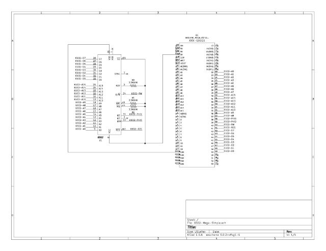
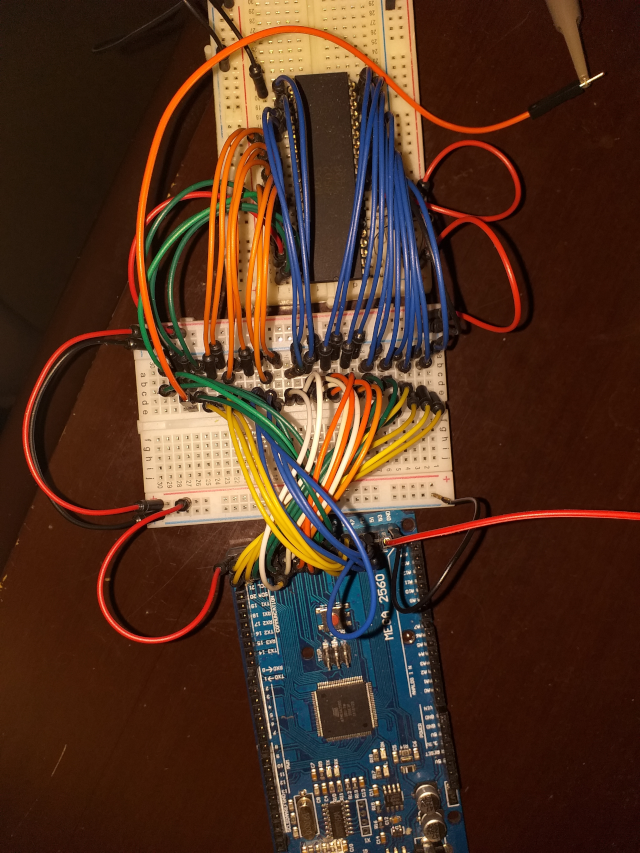
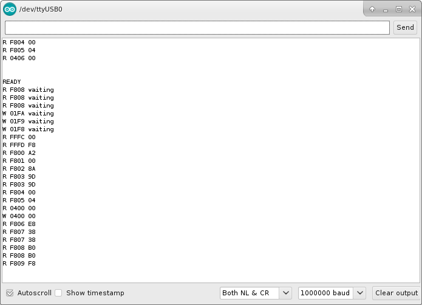
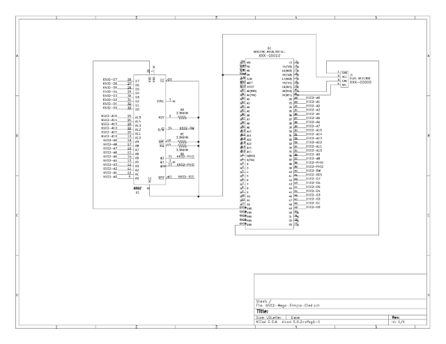
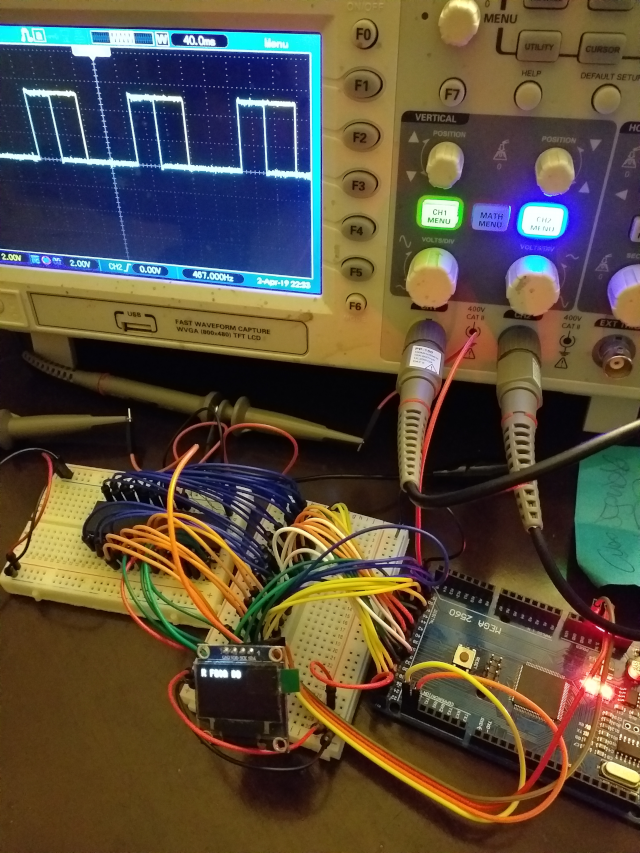
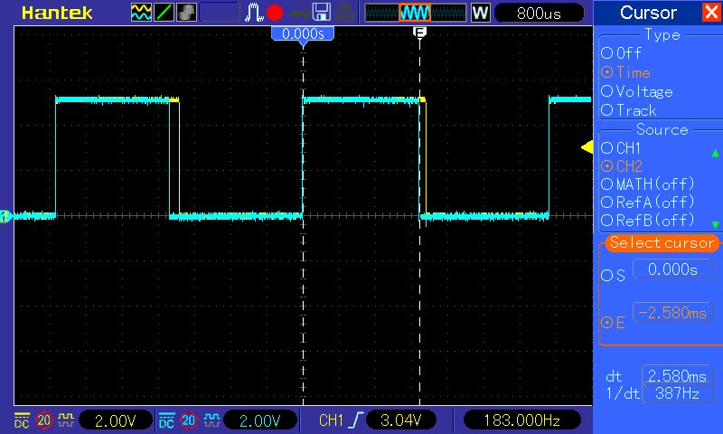

# 6502-VirtualDevices
A real ~~MOS~~ 6502 connected to Virtual Memory/Devices

1. ./ArduinoIDE/6502-Mega-Simple/

  6502 Address Bus, Data Bus and Control Lines connected to an Arduino Mega 2560:
  * Address Bus on ports PA and PC (22 to 29 and 37 to 30)
  * Data Bus on port PL (49 to 42)
  * Clock (PHI0) on PD7 (pin 38) - 5Hz to ¿100KHz?
  * PHI2 on PG2 (pin 39)
  * RW on PG1 (pin 40)
  * RST on PG0 (pin 41)
  * On every PH2 falling edge the data bus is put in High Impedance
  * On every PH2 rising edge:
    * pin 53 is high so you can see it on an oscilloscope
    * the rw line and the data and addres bus is processed using C arrays as virtual RAM/ROM and that info is displayed on Serial
    * pin 53 is low and you can see it on an osciloscoppe 
  
  
  
  

2. ./ArduinoIDE/6502-Mega-Simple-Oled/

  Same as (1), but add an oled SSD1306 is used instead Serial. Displaying data in the oled is slow
  
 
 

3. ./ArduinoIDE/6502-Mega-Serial

  Arduino Mega 2560 acts as a bridge between the 6502 CPU and a Python program as "memory" provider:
  * Connect the board, select the FREQ_6502, adjust the Serial baud rate and upload the code
  * Run "6502-Mega-FunctionalTest.py" (it uses a RAM/ROM image to test the 6502 - https://github.com/Klaus2m5/6502_65C02_functional_tests)
  * Wait 3, 4 or 90 hours to finish (remember the 6502 clock)

  